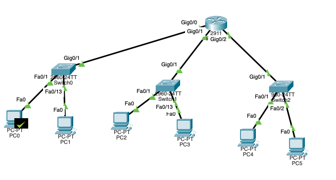

# AG204 – Computer Networks and Security

Σχεδιασμός δικτύου για νέο 3-όροφο εταιρικό κτίριο, στο πλαίσιο του μαθήματος **AG204 – Computer Networks and Security** (University of Essex).

Η εργασία καλύπτει subnetting, σχεδιασμό δικτύου με VLANs & inter-VLAN routing στο Cisco Packet Tracer, ανάλυση κινδύνων ασφάλειας, και ανάλυση πακέτων με Wireshark.

---

## Τοπολογία Δικτύου

Router-on-a-Stick με 1 router (Cisco 2911) και 3 switches (ένα ανά όροφο), που εξυπηρετούν 5 τμήματα μέσω 5 VLANs.

---

## Περιεχόμενα

| Φάκελος / Αρχείο | Περιγραφή |
|------------------|-----------|
| `report/AG204_Report.docx` | Πλήρης αναφορά (Μέρη Α–Δ) |
| `report/AG204_Report.md` | Markdown έκδοση της αναφοράς |
| `AG204_110-12256.pkt` | Αρχείο Cisco Packet Tracer (Μέρος Β) |
| `diagrams/` | Διάγραμμα τοπολογίας |
| `wireshark/` | Ανάλυση & screenshots (Μέρος Δ) |

---

## Σύνοψη Εργασίας

### Α — Subnetting
Από το δίκτυο του ISP `83.112.8.128/25` δημιουργούνται 5 υποδίκτυα με μάσκα **/28 (255.255.255.240)**, ένα ανά τμήμα (14 usable hosts έκαστο):

| Τμήμα | Υποδίκτυο | Εύρος Hosts | Gateway |
|-------|-----------|-------------|---------|
| Sales | 83.112.8.128/28 | .129–.142 | .129 |
| Service | 83.112.8.144/28 | .145–.158 | .145 |
| Management | 83.112.8.160/28 | .161–.174 | .161 |
| E-commerce | 83.112.8.176/28 | .177–.190 | .177 |
| Marketing | 83.112.8.192/28 | .193–.206 | .193 |

### Β — Σχεδιασμός (Packet Tracer)
Τοπολογία αστέρα με Router-on-a-Stick. Κάθε όροφος έχει το δικό του switch· τα τμήματα διαχωρίζονται λογικά σε VLANs (10, 20, 30, 40, 50) και η δρομολόγηση μεταξύ τους γίνεται μέσω sub-interfaces στον router.

### Γ — Ασφάλεια Δικτύου
Ανάλυση 8 βασικών κινδύνων (Malware, Phishing, DDoS, MitM, Unauthorized Access, SQL Injection/XSS, Insider Threats, Physical Security) με αντίστοιχα μέτρα αντιμετώπισης.

### Δ — Ανάλυση Wireshark
Ανάλυση του αρχείου `FileTrace1.pcapng` (DNS, FTP, POP3 κ.ά.) με απαντήσεις σε 10 ερωτήσεις και τεκμηρίωση μέσω screenshots.

---

## Τεχνολογίες

`Cisco Packet Tracer` · `Wireshark` · `Cisco IOS` · `VLANs` · `802.1Q` · `Subnetting`

---

> University of Essex — BSc (Hons) Πληροφορική
